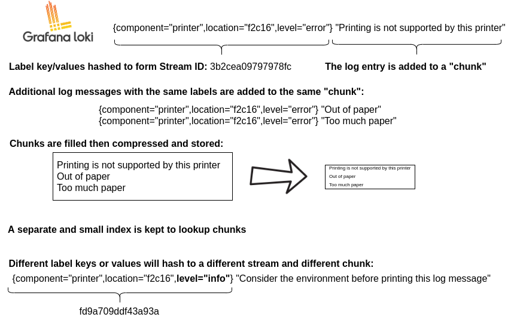

# [Loki](https://grafana.com/docs/loki/latest/)

## Loki architecture
Grafana Loki has a microservices-based architecture and is designed to run as a horizontally scalable, distributed system. The system has multiple components that can run separately and in parallel. Grafana Loki’s design compiles the code for all components into a single binary or Docker image. The -target command-line flag controls which component(s) that binary will behave as.

To get started easily, run Grafana Loki in “single binary” mode with all components running simultaneously in one process, or in “simple scalable deployment” mode, which groups components into read, write, and backend parts.

Grafana Loki is designed to easily redeploy a cluster under a different mode as your needs change, with no configuration changes or minimal configuration changes.

- ### [Loki components](https://grafana.com/docs/loki/latest/get-started/components/#loki-components)

 

### Loki Canary Block
Loki Canary is a standalone app that audits the log-capturing performance of a Grafana Loki cluster.
This component emits and periodically queries for logs, making sure that Loki is ingesting logs without any data loss. When something is wrong with Loki, the Canary often provides the first indication.

Loki Canary generates artificial log lines. These log lines are sent to the Loki cluster. Loki Canary communicates with the Loki cluster to capture metrics about the artificial log lines, such that Loki Canary forms information about the performance of the Loki cluster. The information is available as Prometheus time series metrics.

---

### Loki Retention Configuration
- https://grafana.com/docs/loki/latest/operations/storage/retention/

## Analytics

Data format
The chunk is a container for log entries for a specific set of labels.

