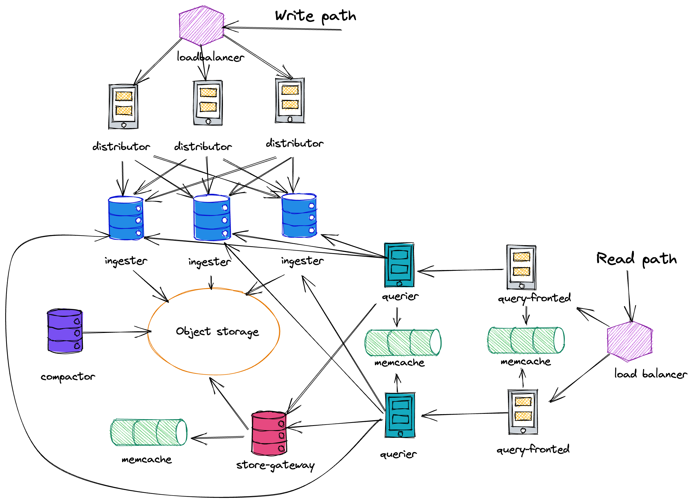

# [Mimir](https://grafana.com/docs/mimir/latest/)

Grafana Mimir has a microservices-based architecture. The system has multiple horizontally scalable microservices that can run separately and in parallel. Grafana Mimir microservices are called components.

Grafana Mimir’s design compiles the code for all components into a single binary. The -target parameter controls which component(s) that single binary will behave as.

## Grafana Mimir components
Most components are stateless and do not require any data persisted between process restarts. Some components are stateful and rely on non-volatile storage to prevent data loss between process restarts. For details about each component, see its page in Components.
- https://grafana.com/docs/mimir/latest/references/architecture/components/