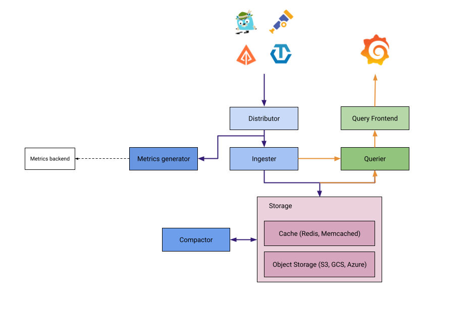

# [Tempo](https://grafana.com/docs/tempo/latest/)
Grafana Tempo is an open-source, easy-to-use, and high-scale distributed tracing backend. Tempo lets you search for traces, generate metrics from spans, and link your tracing data with logs and metrics.

https://grafana.com/docs/tempo/v2.4.x/getting-started/instrumentation/

Tempo comprises of the following top-level components.

## Distributor
The distributor accepts spans in multiple formats including Jaeger, OpenTelemetry, Zipkin. It routes spans to ingesters by hashing the traceID and using a distributed consistent hash ring. The distributor uses the receiver layer from the OpenTelemetry Collector. For best performance, it is recommended to ingest OTel Proto. For this reason the Grafana Agent uses the otlp exporter/receiver to send spans to Tempo.

## Ingester
The Ingester batches trace into blocks, creates bloom filters and indexes, and then flushes it all to the backend. Blocks in the backend are generated in the following layout:

## Query Frontend
The Query Frontend is responsible for sharding the search space for an incoming query.

Traces are exposed via a simple HTTP endpoint: GET /api/traces/<traceID>

Internally, the Query Frontend splits the blockID space into a configurable number of shards and queues these requests. Queriers connect to the Query Frontend via a streaming gRPC connection to process these sharded queries.

## Querier
The querier is responsible for finding the requested trace id in either the ingesters or the backend storage. Depending on parameters it will query both the ingesters and pull bloom/indexes from the backend to search blocks in object storage.

The querier exposes an HTTP endpoint at: GET /querier/api/traces/<traceID>, but its not expected to be used directly.

Queries should be sent to the Query Frontend.

## Compactor
The Compactors stream blocks to and from the backend storage to reduce the total number of blocks.

## Metrics generator
This is an optional component that derives metrics from ingested traces and writes them to a metrics storage. Refer to the metrics-generator documentation to learn more.